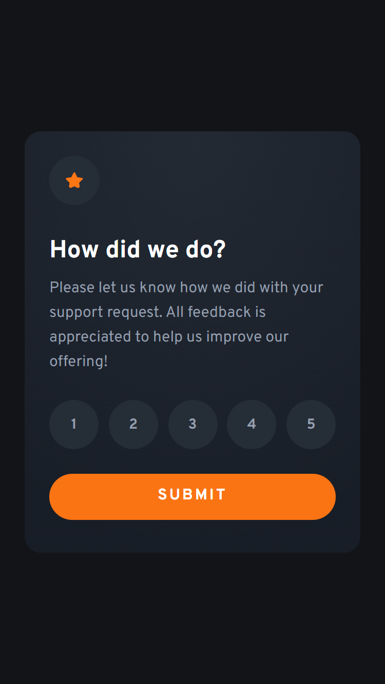

# Frontend Mentor - Interactive rating component solution

This is a solution to the [Interactive rating component challenge on Frontend Mentor](https://www.frontendmentor.io/challenges/interactive-rating-component-koxpeBUmI). Frontend Mentor challenges help you improve your coding skills by building realistic projects.

## Table of contents

- [Overview](#overview)
  - [The challenge](#the-challenge)
  - [Screenshot](#screenshot)
  - [Links](#links)
- [My process](#my-process)
  - [Built with](#built-with)
  - [What I learned](#what-i-learned)
  - [Continued development](#continued-development)
  - [Useful resources](#useful-resources)
- [Author](#author)

## Overview

### The challenge

Users should be able to:

- View the optimal layout for the app depending on their device's screen size
- See hover states for all interactive elements on the page
- Select and submit a number rating
- See the "Thank you" card state after submitting a rating

### Screenshot



### Links

- Solution URL: [https://github.com/miranlegin/fem-interactive-rating-component](https://github.com/miranlegin/fem-interactive-rating-component)
- Live Site URL: [https://frontend-mentor-challenge19.netlify.app/](https://frontend-mentor-challenge19.netlify.app/)

## My process

### Built with

- Semantic HTML5 markup
- CSS custom properties
- CSS Grid
- Mobile-first workflow
- [Vue.js](https://vuejs.org/) - JS framework

### What I learned

After watching some tutorial on Vue.js online i've decided to give it a go on this project and see how it goes. This project was small enough to setup and everything went smoothly from installation forward.

Didn't want to start to ambitious and have hiccups along the way so i first started to markup the HTML from design and applied some basic CSS styling just to get going. Next step was to install Vue.js and i've used their CDN to not make things more complicated than it should be. After that i've brainstorm on how to approach Javascript part and minutes later i've had my first draft.

Coming from Vanilla JS i've added more logic than was necessary and later need to downgrade a bit. Overall experience was quite enjoyable and am looking forward to future challenges.

HTML markup was pretty straightforward and only needed to update original markup on couple of places

---

**Transition wrapper around cards**

```html
<Transition name="slide-up" mode="out-in">...</Transition>
```

**If-else logic**

```html
<div v-if="!voted" class="card rating"></div>

<div v-else class="card thank-you"></div>
```

**v-model for handling checked radio buttons**

```html
<input type="radio" value="1" v-model="pick" />
```

**v-on:click or @click for listening on click event and running a method**

```html
<button class="submit" v-on:click="submitRating">Submit</button>
```

---

Because of adding custom _Transition_ **name** [slide-up] it was necessary to reference it in CSS also

```css
.slide-up-enter-active,
.slide-up-leave-active {
  transition: all 0.75s cubic-bezier(0.35, 0, 0.55, 1);
}
```

---

In just a couple of rows I was able to setup Javascript logic thanks to Vue.js internal mechanism

```js
voted: false,
pick: 0,
```

```js
submitRating() {
  if (this.pick > 0) {
    this.voted = true;
  }
},
```

### Continued development

I'm looking forward to use Vue.js on other challenges and i'm definitely confident to take it up a notch.

### Useful resources

- [Vue.js Crash Course on Youtube](https://www.youtube.com/watch?v=bzlFvd0b65c) - This is the tutorial from which all started.
- [Vue.js docs](https://vuejs.org/guide/built-ins/transition.html) - Helped me to figure out logic behind Vue.js transitions
- [Easings for transitions](https://easings.net/#) - Like always there are more than enough transitions to get started
- [Simple CSS clamp generator](https://clamp.font-size.app/) - For basic need perfect solution

## Author

- Frontend Mentor - [@miranlegin](https://www.frontendmentor.io/profile/miranlegin)
